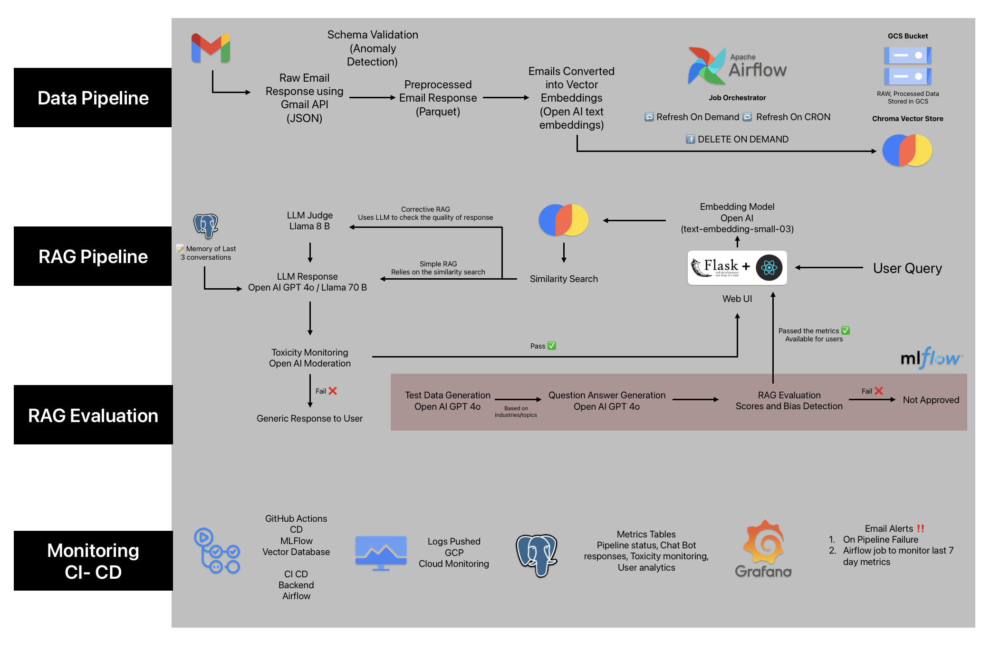

# InboxAI

## Overview
InboxAI is a Retrieval-Augmented Generation (RAG) pipeline designed to revolutionize email data processing and analysis. Our system seamlessly integrates email fetching, processing, and storage capabilities, providing an intuitive web interface for advanced search and analytics.

## Project Structure

The project follows a modular architecture with these key components:

- `/data_pipeline`: Data ingestion and processing scripts
- `/backend`: Server implementation and RAG resources
- `/frontend`: User interface components and assets
- `/rag_model`: RAG evaluators and model quality validation tools
- `/mlflow`: MLFlow tracking server (Docker-based)
- `/vector_db`: Chroma DB vector database setup

## Video Link for Submission

## Architecture
The system architecture is illustrated below:



### Installation Guide

## Getting Started
Refer to individual component directories for specific setup instructions and documentation.

### Installation Guide

Absolutely! Here's a clean, production-grade section you can place at the **top of your `README.md`** under something like:

---

# 🛠️ Step 0: Set Up PostgreSQL on Google Cloud SQL

To enable scalable and managed database support for InboxAI across all components (backend, MLflow, and Airflow), follow these steps to provision a PostgreSQL instance on **Google Cloud SQL**, apply schema DDLs, and make the DB accessible via SQLAlchemy-compatible connection strings.

---

## 🚀 Steps to Set Up PostgreSQL on Cloud SQL

### 1. **Enable Cloud SQL Admin API**

```bash
gcloud services enable sqladmin.googleapis.com
```

---

### 2. **Create a PostgreSQL Instance**

```bash
gcloud sql instances create inboxai-postgres \
  --database-version=POSTGRES_14 \
  --cpu=2 \
  --memory=4GB \
  --region=us-central1
```

> 🔒 By default, public IP connections are disabled. We'll allow access from specific IPs later.

---

### 3. **Create a PostgreSQL Database**

```bash
gcloud sql databases create inboxai_db \
  --instance=inboxai-postgres
```

---

### 4. **Create a Database User**

```bash
gcloud sql users create inboxai_user \
  --instance=inboxai-postgres \
  --password=inboxai-password
```

---

### 5. **Enable Public IP and Whitelist Your IP (Optional for Dev Access)**

```bash
gcloud sql instances patch inboxai-postgres \
  --authorized-networks=$(curl -s ifconfig.me)/32
```

---

### 6. **Get the Public IP of Your Cloud SQL Instance**

```bash
gcloud sql instances describe inboxai-postgres \
  --format="value(ipAddresses.ipAddress)"
```

Let’s say the IP is: `DB_HOST_IP`

---

### 7. **Connect to PostgreSQL Using `psql`**

Install the Cloud SQL Auth Proxy or connect directly:

```bash
psql "host=DB_HOST_IP port=5432 dbname=inboxai_db user=inboxai_user password=inboxai-password"
```

> 💡 You can use tools like [TablePlus](https://tableplus.com/) or [DBeaver](https://dbeaver.io/) for GUI-based access too.

---

### 8. **Run DDLs from Backend**

Apply the schema for your app by running:

```bash
psql "host=DB_HOST_IP port=5432 dbname=inboxai_db user=inboxai_user password=inboxai-password" \
  -f backend/POSTGRES_DDLS.sql
```

This sets up all required tables, constraints, and enums used in your backend API and Airflow DAGs.

---

### 9. **Format the SQLAlchemy `DB_URL`**

Update your `.env` file with this format:

```env
DB_NAME=your_db
DB_USER=your_db_user
DB_PASSWORD=your_db_pass
DB_HOST=DB_HOST_IP
DB_PORT=5432
```

This connection string can now be used across:
- `backend/.env`
- `data_pipeline/.env`
- `mlflow/.env`

## Steps for individual components

- [Data Pipeline](./data_pipeline/README.md)
- [Backend](./backend/README.md)
- [Frontend](./frontend/README.md)
- [MLflow](./mlflow/README.md)
- [Vector DB](./vector_db/README.md)
