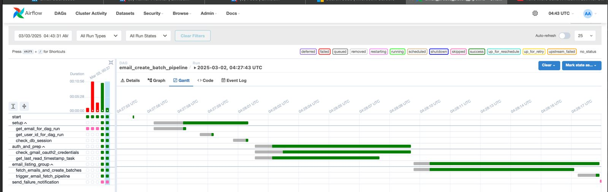
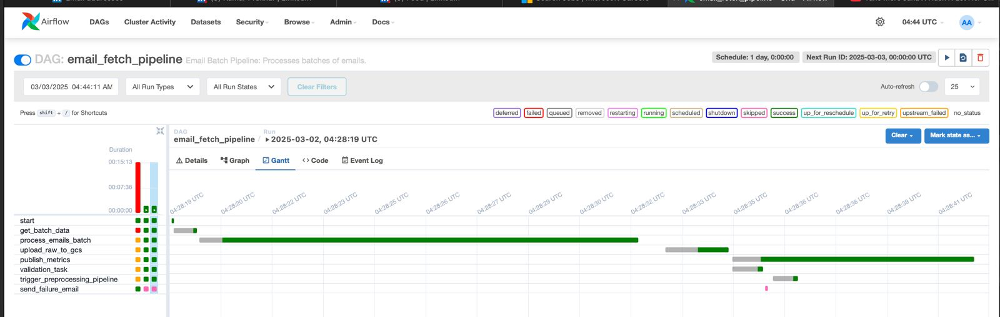
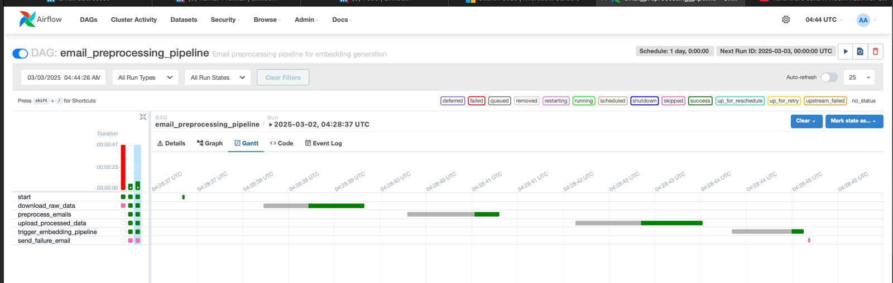
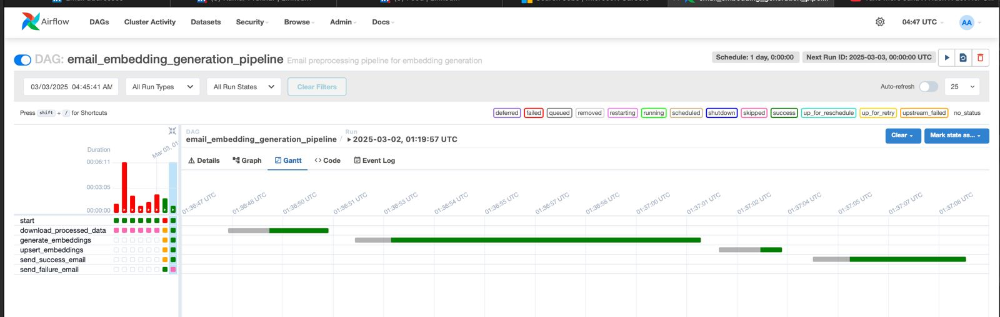
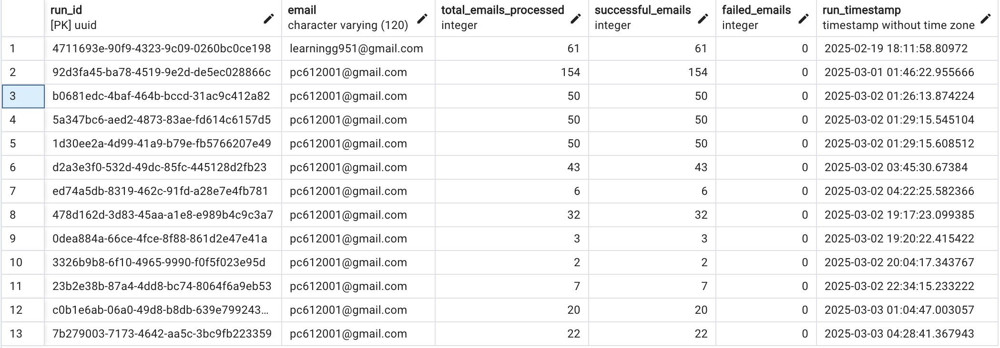

# Airflow Pipeline Structure

This repository contains the Airflow pipeline structure for processing emails. The pipeline is divided into multiple DAGs, each responsible for different stages of the email processing workflow.

## DAGs Overview

### 1. Email Create Batch Pipeline

This DAG fetches emails and creates batches for preprocessing.

- **Tasks:**

  - **Start:** Initializes the pipeline.
  - **Get Email from Dag Run:** Fetches the email address from the DAG run configuration.
  - **Get User ID for Email:** Gets the user ID from the DAG run configuration.
  - **Create DB Session:** Creates a database session for the pipeline.
  - **Check Gmail OAuth2 Credentials:** Checks Gmail OAuth2 credentials for the given email address.
  - **Get Last Read Timestamp:** Fetches the last read timestamp from the database for the given email address.
  - **Fetch Emails and Create Batches:** Fetches emails and creates batches of 50 emails.
  - **Trigger Email Fetch Pipeline:** Triggers the email fetch pipeline for each batch.
  - **Send Failure Notification:** Sends a failure notification email if any task in the pipeline fails.



### 2. Email Fetch Pipeline

This DAG processes batches of emails, uploads raw data to Google Cloud Storage, and performs data validation.

- **Tasks:**
  - **Start:** Initializes the pipeline.
  - **Get Batch Data:** Extracts batch data from the triggering DAG run.
  - **Process Emails in Batch Mode:** Processes emails in batch mode.
  - **Upload Raw Data to GCS:** Uploads raw email data to Google Cloud Storage in batches.
  - **Publish Metrics:** Publishes metrics for the pipeline.
  - **Data Validation:** Performs data validation on the processed emails.
  - **Trigger Preprocessing Pipeline:** Triggers the preprocessing pipeline if data validation is successful.
  - **Send Failure Email:** Sends a failure email if data validation fails.



### 3. Email Preprocessing Pipeline

This DAG preprocesses emails, uploads processed data to Google Cloud Storage, and triggers the embedding pipeline.

- **Tasks:**

  - **Start:** Initializes the pipeline.
  - **Download Raw Data from GCS:** Downloads raw email data from Google Cloud Storage.
  - **Preprocess Emails:** Preprocesses the downloaded emails to clean up the HTML and PII redacting.
  - **Upload Processed Data to GCS:** Uploads the processed email data to Google Cloud Storage.
  - **Trigger Embedding Pipeline:** Triggers the embedding generation pipeline if preprocessing is successful.
  - **Send Failure Email:** Sends a failure email if any task in the pipeline fails.



### 4. Email Embedding Pipeline

This DAG generates embeddings for the preprocessed emails.

- **Tasks:**

  - **Start:** Initializes the pipeline.
  - **Download Processed Data from GCS:** Downloads processed email data from Google Cloud Storage.
  - **Generate Embeddings:** Generates embeddings for the downloaded emails.
  - **Upsert Embeddings:** Upserts the generated embeddings to the Chroma Vector Database.
  - **Send Success Email:** Sends a success email if all tasks in the pipeline succeed.
  - **Send Failure Email:** Sends a failure email if any task in the pipeline fails.



## Visualizing the Pipeline

For a better understanding of the pipeline flow, refer to the `flow.mermaid` file. This file contains a visual representation of the entire email processing workflow using Mermaid.js.

## File Structure

```
airflow/
└── config/
    ├── credentials.json                    # TODO: USERS GMAIL API CREDENTIALS
    ├── google_sa.json                      # TODO: USERS GOOGLE CLOUD SERVICE ACCOUNT
    dags/
    ├── __init__.py                         # Package initialization
    ├── email_01_create_batch_pipeline.py   # DAG for email batch creation
    ├── email_02_fetch_pipeline.py          # DAG for fetching emails
    ├── email_03_preprocessing_pipeline.py  # DAG for preprocessing emails
    ├── email_04_embedding_pipeline.py      # DAG for generating embeddings
    ├── models_postgres.py                  # PostgreSQL database models
    ├── models_pydantic.py                  # Pydantic models for validation
    ├── auth/
    │   ├── __init__.py                     # Authentication package initialization
    │   └── gmail_auth.py                   # Gmail authentication utilities
    ├── services/
    │   ├── gmail_service.py                # Gmail API interaction service
    │   └── storage_service.py              # GCS storage interaction service
    ├── tasks/
    │   ├── __init__.py                     # Tasks package initialization
    │   ├── email_batch_tasks.py            # Tasks for batch creation
    │   ├── email_embedding_tasks.py        # Tasks for embedding generation
    │   ├── email_fetch_tasks.py            # Tasks for email fetching
    │   └── email_preprocess_tasks.py       # Tasks for email preprocessing
    └── utils/
        ├── __init__.py                     # Utilities package initialization
        ├── airflow_utils.py                # Airflow-specific utilities
        ├── db_utils.py                     # Database interaction utilities
        └── preprocessing_utils.py          # Email preprocessing utilities
```

### Modular Syntax and Code

- Each pipeline component is implemented as an independent module
- Functions and classes follow single responsibility principle
- Common utilities are centralized in the `utils` directory
- Code reuse across DAGs is maximized through abstraction

### Pipeline Orchestration

- Airflow DAGs with clear dependency chains
- Dynamic task generation based on data volume
- Cross-DAG dependencies managed through TriggerDagRunOperator

### Tracking and Logging

- Comprehensive logging at all pipeline stages
- Custom logger formatting with task context

### Data Version Control

- Raw email data versioned in GCS with timestamped directories
- Processed data versions maintained with clear lineage
- Metadata tracking for each processing stage
- Configuration files versioned in Git

### Pipeline Flow Optimization

- The pipeline is broken into chunks of 50 emails
- The pipelines which are not dependent on API calls are all parallelized.

### Schema and Statistics Generation

- Data validation with Pydantic models
- Statistical analysis of email corpus characteristics
- Data quality validation at each pipeline stage
- Configuration validation for pipeline parameters



### Anomaly Detection and Alert Generation

- Outlier detection for email processing metrics
- Alerts for processing failures or timeout issues through Email.
- Data quality checks to validate content extraction

### Testing

- Unit tests for core utility functions
- Mock services for Gmail and GCS testing
